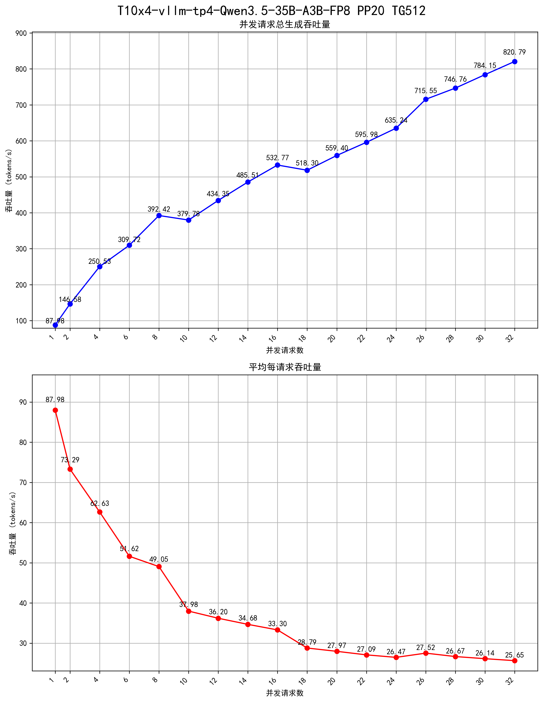

# 大模型吞吐量测试工具

## 项目功能

本项目是一个用于测试大模型API吞吐量的工具集，主要功能包括：

1. **日志采集**：通过 `step_1_vllm_log_to_csv.py` 实时监控并解析 vLLM Docker 容器的日志，提取性能指标并保存到 CSV 文件。
2. **并发测试**：通过 `step_2_load_test.py` 发送并发请求，测试不同并发数下的模型响应性能。
3. **数据处理**：通过 `step_3_vllm_csv_analyzer.py` 处理采集到的日志数据，计算不同并发数下的平均吞吐量。
4. **结果可视化**：通过 `step_4_plot_throughput.py` 绘制吞吐量测试结果图表，直观展示不同并发数下的性能表现。

## 项目限制

- **仅支持 vLLM**：本工具专为 vLLM Docker 容器设计，只能通过 Docker 容器运行的 vLLM 才能采集到 vLLM 日志里的吞吐量信息。
- **依赖 Docker**：日志采集功能依赖于 Docker 命令，需要确保 Docker 服务正常运行。

## 安装依赖

### 前提条件

- Python 3.7+ 
- Docker 环境（用于运行 vLLM 容器和采集日志）

### 安装步骤

1. 克隆项目到本地：

```bash
git clone <repository_url>
cd vllm_api_throughput_test
```

2. 安装所需依赖：

```bash
pip install aiohttp rich pandas matplotlib
```

## 配置说明

### vLLM 容器配置（必要设置）

**必须**在运行 vLLM 容器时设置以下环境变量，以确保日志刷新速率足够快，从而准确采集性能指标：

```bash
VLLM_LOG_STATS_INTERVAL=1.0
```

这将使 vLLM 每 1 秒刷新一次性能统计日志，确保测试过程中能够实时捕获性能数据。

### 测试工具配置

在运行测试前，需要配置 `config/config.json` 文件，主要配置项如下：

| 配置项 | 说明 | 示例值 |
|-------|------|-------|
| docker_container_name | vLLM 容器名称 | vllm-Qwen3.5-27B-seqs32 |
| test_result_remarks | 测试结果备注 | T10x4-vllm-tp4-Qwen3.5-27B-FP8-并发吞吐量测试 |
| max_concurrent | 最大测试并发数 | 32 |
| step | 并发递增步长 | 2 |
| api_url | API endpoint 地址 | http://127.0.0.1:8080/v1/chat/completions |
| api_key | API Key | api-key-abc123 |
| model | 模型名称 | Qwen3.5-27B |
| max_tokens | 最大生成 token 数 | 256 |
| temperature | 温度 (0.0~2.0) | 0.6 |
| top_p | top_p (0.0~1.0) | 0.95 |
| request_timeout | 单请求超时秒数 | 90 |
| interval_between_batches | 批次间等待时间（秒） | 2 |

## 使用方法

按照以下顺序执行测试：

### 1. 配置 config.json

根据实际环境修改 `config/config.json` 文件中的配置项，确保 `docker_container_name` 与实际运行的 vLLM 容器名称一致，`api_url` 指向正确的 API 地址。

### 2. 进入 tools 目录，运行 step_1_vllm_log_to_csv.py

```bash
python step_1_vllm_log_to_csv.py
```

该脚本会启动日志监控，实时解析 vLLM 容器的日志并将性能指标保存到 `output/vllm_metrics.csv` 文件中。

### 3. 进入 tools 目录，运行 step_2_load_test.py

```bash
python step_2_load_test.py
```

该脚本会根据配置文件中的 `max_concurrent` 和 `step` 生成测试并发数序列，然后依次发送并发请求，测试不同并发数下的模型性能。

### 4. 进入 tools 目录，运行 step_3_vllm_csv_analyzer.py

```bash
python step_3_vllm_csv_analyzer.py
```

该脚本会读取 `output/vllm_metrics.csv` 文件，进行数据清洗和处理，计算不同并发数下的平均吞吐量，并将结果保存到 `output/throughput_summary.csv` 文件中。

### 5. 进入 tools 目录，运行 step_4_plot_throughput.py

```bash
python step_4_plot_throughput.py
```

**使用英文标签**（避免 Linux 下中文乱码）：

```bash
python step_4_plot_throughput.py --en
```

该脚本会读取 `output/throughput_summary.csv` 文件，绘制吞吐量测试结果图表，并将图表保存为 `output/throughput_charts.png` 文件。

## 输出文件说明

- `output/vllm_metrics.csv`：原始日志解析后的性能指标数据
- `output/throughput_summary.csv`：处理后的平均吞吐量统计数据
- `output/throughput_charts.png`：吞吐量测试结果图表

### 测试结果示例

以下是测试结果图表示例：



## 注意事项

1. 确保 vLLM 容器正在运行，并且容器名称与配置文件中的 `docker_container_name` 一致。
2. 测试过程中，建议保持网络稳定，避免网络波动影响测试结果。
3. 对于高并发测试，确保服务器资源充足，避免因资源不足导致测试结果不准确。
4. 测试完成后，可以通过 `throughput_charts.png` 图表直观查看不同并发数下的吞吐量表现。

